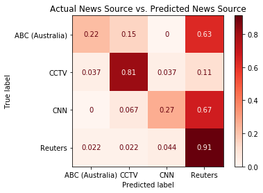
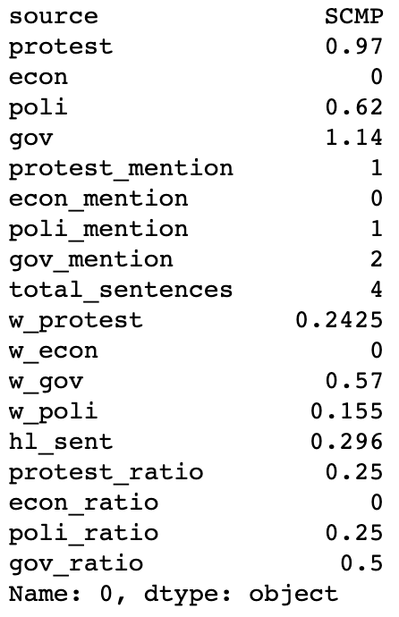

# The Language in News Rework

App: https://stormy-island-97029.herokuapp.com/

Contributor: Wayne Lam

Previous Project: https://github.com/wplam107/Final_Project

Previous App/Dashboard: https://language-in-news.herokuapp.com/

## Goals
- To produce a news source classifier for news articles.
  - Create classifier based on topic features modeled from LDA Mallet and classifier based on mean word vector by using pretrained vectors from GloVe.
- Reduce sources to only non-SCMP sources.
  - Reducing sample size and generalizability of insights while controlling for local vs. international news source variable.

## Classifier Model
An XGBoost classifier model was trained on 799 news articles from ABC, CCTV, CNN, and Reuters.  There was a class imbalance where Reuters accounted for over half of the observations.  Based on the mean word vector of a news article the model predition breakdowns are as follows:

## Background (Previous Project)
In mid 2019 through early 2020 a prominent subject in the news was the Hong Kong protests over various pieces of legislation proposed by the Hong Kong government.   In a previous project (https://github.com/wplam107/Final_Project) on news articles on the Hong Kong protests from 5 sources (ABC Australia, Reuters, CCTV, CNN, and the South China Morning Post) were clustered based on several NLP features.  The features included the ratio of sentences tagged as a particular topic (choosing dominant topic) with LDA Mallet and the sentiment of a news article on the topics.

### Sample (Previous Project)

### Problems (Previous Project)
- Sentiment of a topic in a news article was highly correlated with the number of sentences tagged as *that* topic in the news article.
  - Example: If a news article has a lot of sentences on the protests topic vs. the other topics, the sentiment on the protests topic will be greater than that of the other topics.
- South China Morning Post created a major class imbalance.  The South China Morning Post (SCMP) accounted for nearly half of the articles.
  - When the LDA model was trained on the entire corpus the coherence score was greatest when there were 20+ topics.
  - When the LDA model was trained on the corpus minus SCMP corpus the coherence score was greatest at 4 topics.
- Did not separate out quotes and non-quotes.
  - Determining ratio of quote and non-quote sentences may help indicate access to government, protester, or organizational sources.

### Insights (Previous Project)
Different news sources appear to focus on different topics with respect to a particular subject.  
- Statistically significant differences between sources on sentiment on topics.
  - Example: *When* a CCTV article had a sentence tagged as the government topic the sentiment score was much higher than *when* a Reuters article had a sentence tagged as the government topic.
- Statistically significant differences between sources in topic ratios.
  - Example: CCTV articles were far more likely to have a high number of sentences tagged as the government topic whereas Reuters articles were far more likely to have a high number of sentences tagged as the economic topic.

